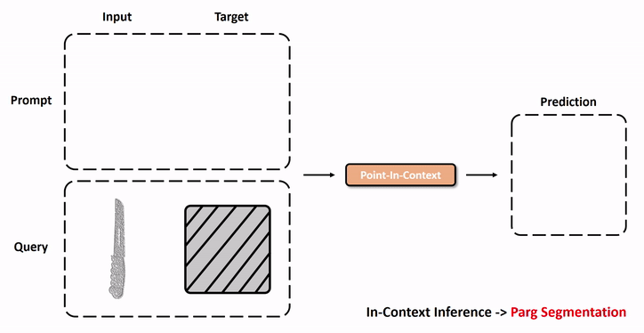
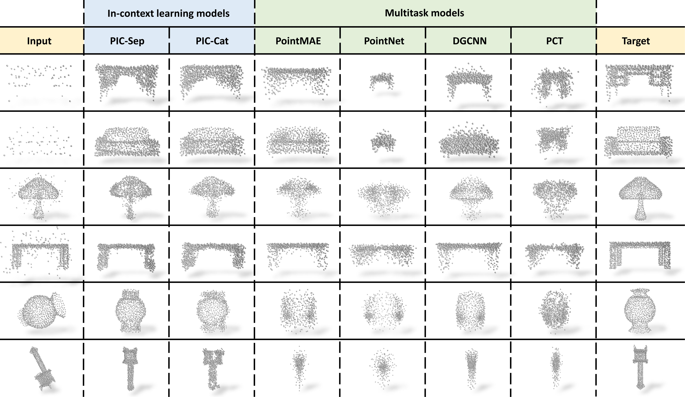

<br />
<p align="center">
  <h1 align="center">Explore In-Context Learning for 3D Point Cloud Understanding</h1>
  <p align="center">
    Arxiv, 2023
    <br />
    <a href="https://github.com/fanglaosi/"><strong>Zhongbin Fang</strong></a>
    ·
    <a href="https://lxtgh.github.io/"><strong>Xiangtai Li</strong></a>
    ·
    <a href="https://xialipku.github.io/"><strong>Xia Li</strong></a>
    <br />
    <a href="ml.inf.ethz.ch/"><strong>Joachim M. Buhmann</strong></a>
    .
    <a href="https://www.mmlab-ntu.com/person/ccloy/"><strong>Chen Change Loy</strong></a>
    .
    <a href="https://www.ece.pku.edu.cn/info/1046/2596.htm"><strong>Mengyuan Liu*</strong></a>
  </p>

  <p align="center">
<!--     <a href='https://arxiv.org/abs/2303.12782'>
      
    </a> -->
    <a href='https://github.com/fanglaosi/Point-In-Context' style='padding-left: 0.5rem;'>
      
    </a>
  </p>
<br />

Our work is **<font color="#dd0000">the first</font>** to explore in-context learning in 3D point clouds, including task definition, benchmark, and baseline models.


**(a)** In-context learning in NLP, **(b)** In-context learning in 2D vision, **(c)** Our proposed in-context learning for 3D point clouds.


## Abstract

With the rise of large-scale models trained on broad data, in-context learning has become a new learning paradigm that has demonstrated significant potential in natural language processing and computer vision tasks. Meanwhile, in-context learning is still largely unexplored in the 3D point cloud domain. Although masked modeling has been successfully applied for in-context learning in 2D vision, directly extending it to 3D point clouds remains a formidable challenge. In the case of point clouds, the tokens themselves are the point cloud positions (coordinates) that are masked during inference. Moreover, position embedding in previous works may inadvertently introduce information leakage. To address these challenges, we introduce a novel framework, named Point-In-Context, designed especially for in-context learning in 3D point clouds, where both inputs and outputs are modeled as coordinates for each task. Additionally, we propose the Joint Sampling module, carefully designed to work in tandem with the general point sampling operator, effectively resolving the aforementioned technical issues. We conduct extensive experiments to validate the versatility and adaptability of our proposed methods in handling a wide range of tasks. Furthermore, with a more effective prompt selection strategy, our framework surpasses the results of individually trained models.

## Point-In-Context


**Point-In-Context-Sep**. $\color{#2F6EBA}{Top}$: During training, each sample comprises two pairs of input and target point clouds that tackle the same task. These pairs are fed into the transformer model to perform the masked point reconstruction task, which follows a random masking process. $\color{#2F6EBA}{Bottom}$: In-context inference on multitask. Our Point-In-Context could infer results on various downstream point cloud tasks, including reconstruction, denoising, registration, and part segmentation.


**Point-In-Context-Cat**. Unlike PIC-Sep, PIC-Cat concatenates the input and target to form a new point cloud.

## Features

### $In-context\ learning\ for\ 3D\ understanding$

- The first work to explore the application of in-context learning in the 3D domain.
- A new framework for tackling multiple tasks (four tasks), which are unified into the same input-output space.
- Can improve the performance of our Point-In-Context (Sep & Cat) by selecting higher-quality prompts.

### $New\ benchmark$

- A new multi-task benchmark for evaluating the capability of processing multiple tasks, including reconstruction, denoising, registration, and part segmentation.

### $Strong\ performance$

- Surpasses classical models (PointNet, DGCNN, PCT, PointMAE), which are equipped with multi-task heads.
- Surpasses even task-specific models (PointNet, DGCNN, PCT) on registration when given higher-quality prompts.

## Visualization

In-context inference demo (part segmentation, denoising, registration).



Visualization of predictions obtained by our PIC-Sep and their corresponding targets in different point cloud tasks.


Comparison results between our Point-In-Context (Sep & Cat) and multi-task models.



## Code

**The code will be released upon the acceptance of the submission.**

## Citation
If you think Point-In-Context is helpful in your research, please consider referring Point-In-Context:
```bibtex

```
